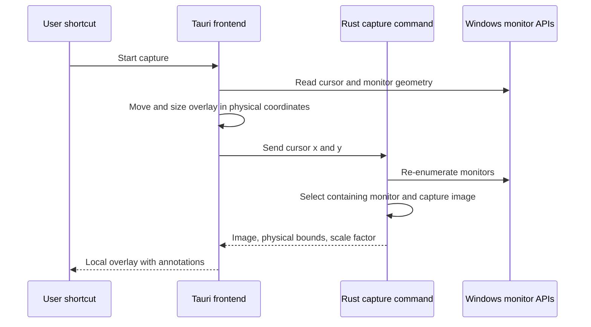

# QPaste Engineering Evidence

## Problem and root cause

The overlay needed to open on the physical monitor containing the cursor. Windows desktops can place monitors to the left or above the primary display, producing negative coordinates. Mixed display scaling means physical image pixels and logical CSS coordinates cannot be treated as the same space.

## Solution

The frontend obtains the cursor position and monitor geometry, positions the Tauri window using physical coordinates, and invokes the Rust capture command. Rust re-enumerates monitors, selects the monitor containing the cursor, captures only that monitor, and returns its position, size, scale factor, and encoded image. The frontend loads the image and renders it in the monitor-local canvas coordinate system.

## Contribution

This is a derivative work based on QPaste by leon6002. The contribution documented here is the Windows multi-monitor behavior, cursor-based target selection, negative-coordinate handling, mixed-DPI alignment, and related notes. It does not claim ownership of the original application foundation.
